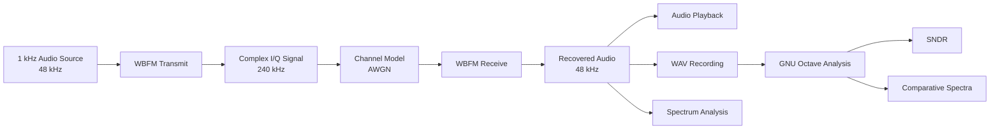
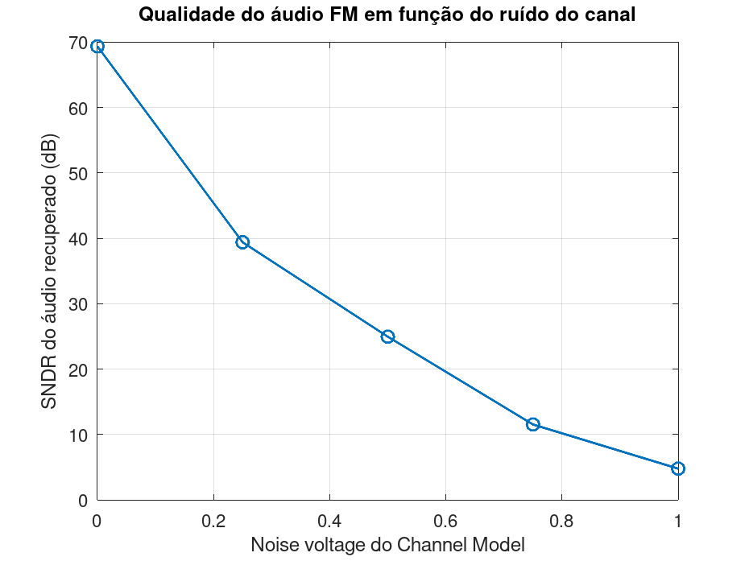
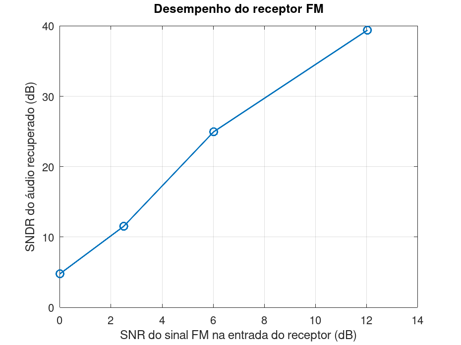
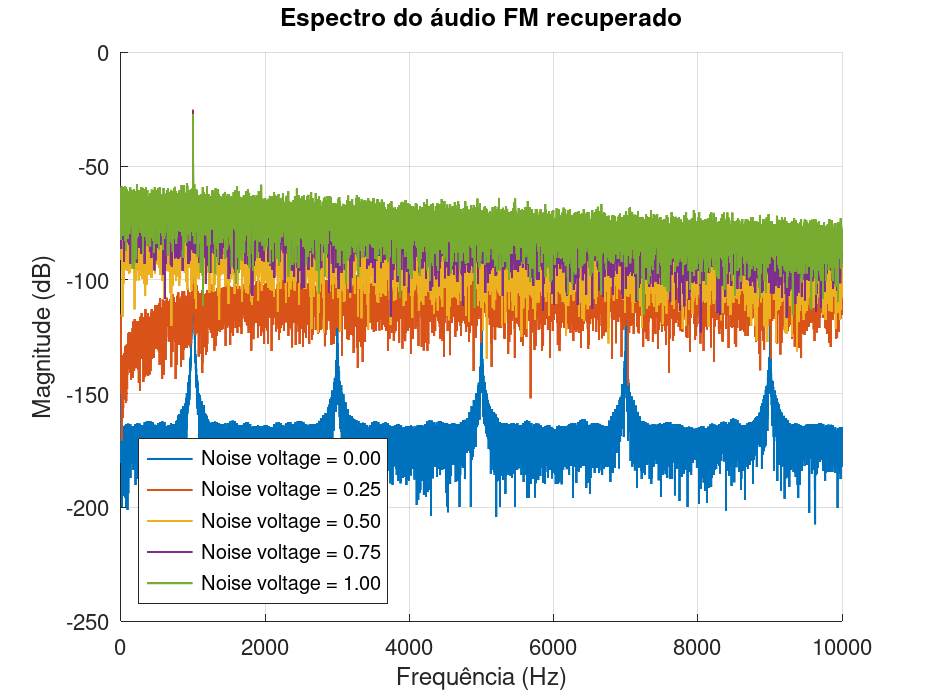

# FM Broadcast Monitor

A DSP and telecommunications project focused on **wideband FM transmission, channel degradation, demodulation, and recovered-audio quality analysis**.

The project starts with a fully simulated FM link in GNU Radio and progressively moves toward real broadcast reception using SDR hardware and C++-based signal analysis.

> **Current status:** Phase 1 — Simulated FM Channel Characterization — completed.

---

## Overview

The first phase implements a complete WBFM signal chain:

```text
1 kHz Test Tone
      ↓
WBFM Transmitter
      ↓
AWGN Channel Model
      ↓
WBFM Receiver
      ↓
Recovered Audio
      ↓
Spectral Analysis + SNDR Measurement
```

The goal is not only to demodulate FM, but to **measure how degradation in the RF channel affects the recovered audio**.

This creates a practical bridge between:

- Digital Signal Processing
- Telecommunications
- Audio Engineering
- Software Defined Radio
- Measurement and instrumentation
- Signal-quality analysis

---

## System Architecture



---

## Experimental Setup

| Parameter | Value |
|---|---:|
| Audio sample rate | 48 kHz |
| Quadrature sample rate | 240 kHz |
| Reference tone | 1 kHz |
| FM maximum deviation | 75 kHz |
| FM pre/de-emphasis time constant | 75 µs |
| Channel model | AWGN |
| Noise voltage values | 0.00, 0.25, 0.50, 0.75, 1.00 |
| Analysis environment | GNU Octave |
| Flowgraph environment | GNU Radio Companion |

The receiver output was recorded for each channel-noise level and analyzed offline.

---

## GNU Radio Flow

The simulated link uses the following main blocks:

```text
Signal Source
      ↓
WBFM Transmit
      ↓
Throttle
      ↓
Channel Model
      ├──────────────→ FM Spectrum
      ↓
WBFM Receive
      ↓
Multiply Const
      ├──────────────→ Audio Spectrum
      ├──────────────→ Audio Waveform
      ├──────────────→ Audio Sink
      └──────────────→ WAV File Sink
```

The channel noise can be adjusted interactively during testing.

---

## Audio Quality Metric

The recovered 1 kHz tone is estimated from each recording using a least-squares sinusoidal fit:

```text
x[n] = A·cos(2πf₀n/fs) + B·sin(2πf₀n/fs) + e[n]
```

where:

- `f₀ = 1 kHz`
- the fitted sinusoid represents the desired recovered tone;
- `e[n]` contains residual noise and distortion.

The output quality is then expressed as **SNDR — Signal-to-Noise-and-Distortion Ratio**:

```text
SNDR = 10·log10(Ptone / Perror)
```

This allows the degradation of the recovered audio to be quantified rather than evaluated only by listening.

---

## Results

### Measured output SNDR

| Channel noise voltage | Estimated normalized RF input SNR | Audio output SNDR |
|---:|---:|---:|
| 0.00 | Clean reference | 69.36 dB |
| 0.25 | 12.04 dB | 39.40 dB |
| 0.50 | 6.02 dB | 24.96 dB |
| 0.75 | 2.50 dB | 11.53 dB |
| 1.00 | 0.00 dB | 4.78 dB |

The measurements show a strong reduction in recovered-audio quality as channel noise increases.

---

### Channel noise vs. recovered-audio SNDR



The clean reference reaches approximately **69 dB SNDR**. As the channel-noise voltage increases, the residual noise and distortion become progressively more significant.

---

### Receiver performance



This plot relates the estimated input-channel quality to the measured output-audio quality.

The results clearly show that improving the RF signal-to-noise condition produces a much larger SNDR at the demodulated audio output.

> **Technical note:** GNU Radio's Channel Model exposes AWGN as a `noise_voltage` parameter rather than a calibrated RF SNR. The RF-SNR values shown here are normalized simulation estimates based on the configured noise amplitude and unit signal-power assumption. They should not be interpreted as calibrated antenna-port measurements.

---

### Recovered audio spectra



The 1 kHz reference tone remains visible in every experiment, while the broadband spectral floor rises strongly as channel noise increases.

The clean reference also reveals very small residual harmonic components, which can be investigated in a later stage as part of distortion characterization.

---

## Main Findings

The first experiment demonstrates that:

- WBFM modulation and demodulation were successfully implemented end-to-end.
- The original 1 kHz audio tone can be recovered after FM modulation and channel simulation.
- Increasing AWGN raises the recovered-audio noise floor.
- The measured output SNDR decreases from approximately **69.36 dB** in the clean reference to **4.78 dB** at the highest tested noise level.
- Spectral analysis and objective measurements agree with the audible degradation observed during the experiment.
- A complete measurement workflow was created from RF simulation to audio recording and offline DSP analysis.

---

## Repository Structure

```text
fm-broadcast-monitor/
├── analysis/
│   └── analyze_noise.m
│
├── flowgraphs/
│   ├── fm_simulation.grc
│   └── fm_noise_analysis.grc
│
├── recordings/
│   └── *.wav
│
├── results/
│   ├── audio_spectra_comparison.png
│   ├── noise_vs_sndr.png
│   ├── rf_snr_vs_audio_sndr.png
│   └── noise_analysis.csv
│
├── docs/
├── src/
├── .gitignore
└── README.md
```

Raw WAV recordings can be excluded from Git tracking because they are experimental intermediate files.

---

## Reproducing the Analysis

### Requirements

- GNU Radio
- GNU Radio Companion
- GNU Octave
- Linux

### Run the GNU Radio experiment

Open:

```bash
gnuradio-companion flowgraphs/fm_noise_analysis.grc
```

Record the recovered audio for the desired channel-noise values.

### Run the Octave analysis

From the repository root:

```bash
octave --quiet analysis/analyze_noise.m
```

The script generates:

```text
results/noise_analysis.csv
results/noise_vs_sndr.png
results/rf_snr_vs_audio_sndr.png
results/audio_spectra_comparison.png
```

---

## Development Roadmap

### Phase 1 — Simulated FM Channel Characterization

- [x] Generate a synthetic audio reference
- [x] Implement WBFM transmission
- [x] Simulate an AWGN channel
- [x] Demodulate WBFM
- [x] Recover and reproduce the audio
- [x] Add interactive channel-noise control
- [x] Record output audio
- [x] Implement spectral analysis
- [x] Implement SNDR measurement
- [x] Characterize channel degradation

### Phase 2 — Real Audio Transmission

- [ ] Replace the 1 kHz test tone with real audio
- [ ] Compare original and recovered program material
- [ ] Evaluate audio degradation under different channel conditions
- [ ] Add additional objective audio-quality metrics

### Phase 3 — Real FM Broadcast Reception

- [ ] Integrate an RTL-SDR receiver
- [ ] Tune real FM broadcast stations
- [ ] Visualize real RF spectra
- [ ] Demodulate live FM broadcasts
- [ ] Measure received-signal and recovered-audio quality
- [ ] Detect signal loss and degradation events

### Phase 4 — C++ DSP Monitoring

- [ ] Move selected analysis modules to C++
- [ ] Implement real-time spectral measurements
- [ ] Implement automatic signal-quality monitoring
- [ ] Generate technical reports from captured signals
- [ ] Build a monitoring-oriented interface

---

## Skills Demonstrated

This project currently applies:

- Digital Signal Processing
- FM modulation and demodulation
- Complex I/Q signals
- Sampling and decimation
- FFT and spectral analysis
- AWGN channel modeling
- Audio signal analysis
- SNDR measurement
- Least-squares signal estimation
- GNU Radio
- GNU Octave
- Linux
- Git and GitHub

---

## Project Direction

The long-term goal is to evolve the project from a controlled simulation into a **broadcast signal monitoring system** capable of receiving real RF signals, demodulating audio, measuring technical quality indicators, and detecting degradation automatically.

This progression keeps the project focused on the intersection of **DSP, audio, telecommunications, and broadcast engineering**.
